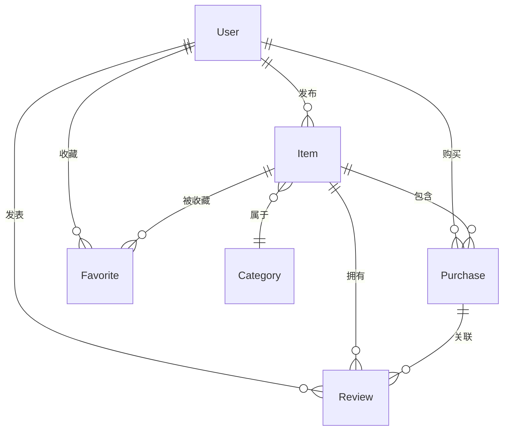

# 农产品线上电商销售管理系统 — 课程设计报告

---

## 一、需求分析

### 1.1 用户角色与功能需求

本系统面向三类用户角色，每类角色具有不同的功能权限：

#### （1）普通消费者
- 浏览商品：查看商品列表、商品详情、价格趋势
- 搜索筛选：按关键词、分类、价格范围多条件检索
- 购买商品：选择数量下单、支付订单、确认收货
- 评价反馈：对已完成的订单进行星级评分和留言
- 售后申请：对已完成的订单发起售后申请
- 收藏商品：将感兴趣的商品加入收藏夹

#### （2）农户商家
- 商品管理：发布农产品、编辑商品信息、上下架管理
- 库存管理：设置和修改商品库存数量
- 多条件检索：按名称、分类、产地、价格检索自己的商品
- 订单管理：查看销售订单、确认发货、填写物流信息
- 售后处理：查看售后申请原因，处理售后请求
- 数据统计：查看销量统计卡片和单品销售饼图
- 评价管理：查看商品评价、回复评价、删除回复

#### （3）系统管理员
- 分类管理：添加和删除商品分类
- 商品监管：强制下架违规商品、重新上架
- 账号管理：禁用或解禁用户账号
- 公告管理：发布和删除系统公告
- 评价监管：强制删除违规评价（隐藏不显示）

### 1.2 核心业务流程

#### 用户管理流程
```
注册 → 选择角色（消费者/商家）→ 填写信息 → 登录 → 权限校验 → 进入对应界面
```

#### 商品管理流程（商家）
```
发布商品 → 填写名称/描述/价格/产地/规格/库存/分类/图片
→ 提交 → 商品上架（状态=售卖中）
→ 编辑/修改 → 更新信息
→ 下架 → 状态=已下架
```

#### 订单管理流程
```
买家选购 → 选择数量 → 生成订单（状态=待付款）
→ 买家付款 → 状态=待发货
→ 商家确认发货 → 填写物流单号 → 状态=已发货
→ 买家确认收货 → 状态=已完成
→ 买家申请售后 → 填写原因 → 状态=售后中
→ 商家处理售后 → 状态=已完成
```

#### 评价反馈流程
```
订单完成后 → 买家进入评价页面 → 选择星级评分（1-5星）
→ 填写评价内容 → 提交评价
→ 商家查看评价 → 可回复评价
→ 买家可删除自己的评价
→ 管理员可强制删除违规评价（隐藏）
```

### 1.3 非功能需求

- **界面友好**：采用 Vue 3 + Element Plus 风格，响应式布局，角色导航动态显示
- **操作便捷**：商品多条件检索、一键上下架、批量操作
- **较好的扩展性**：前后端分离架构，RESTful API 设计，易于扩展新功能
- **安全性**：JWT Token 认证，角色权限控制
- **数据可视化**：ECharts 价格趋势图、单品销售饼图

---

## 二、系统设计

### 2.1 系统架构设计

本系统采用前后端分离架构：

```
┌──────────────────────────────────────────────────┐
│                  前端（Vue 3 + Vite）              │
│  ┌──────────┐ ┌──────────┐ ┌──────────────────┐  │
│  │ 用户界面  │ │ 路由管理  │ │ 状态管理 & API调用│  │
│  └──────────┘ └──────────┘ └──────────────────┘  │
└──────────────────────┬───────────────────────────┘
                       │ HTTP (RESTful API)
┌──────────────────────▼───────────────────────────┐
│                后端（FastAPI + Python）            │
│  ┌──────────┐ ┌──────────┐ ┌──────────────────┐  │
│  │ 认证模块  │ │ API路由  │ │ 业务逻辑处理      │  │
│  └──────────┘ └──────────┘ └──────────────────┘  │
└──────────────────────┬───────────────────────────┘
                       │ SQLAlchemy ORM
┌──────────────────────▼───────────────────────────┐
│                数据库（MySQL 8.0）                 │
│  用户表 │ 商品表 │ 订单表 │ 评价表 │ 分类表 ...   │
└──────────────────────────────────────────────────┘
```

### 2.2 功能模块结构

```
农产品线上电商销售管理系统
│
├── 1. 用户管理模块
│   ├── 注册（角色选择：消费者/商家）
│   ├── 登录（JWT Token 认证）
│   ├── 权限控制（导航按角色显示）
│   └── 管理员管理（分类/商品/账号管理）
│
├── 2. 商品管理模块
│   ├── 商品发布（名称/描述/价格/产地/规格/库存/图片）
│   ├── 商品编辑（信息修改、图片更换）
│   ├── 上下架管理（批量状态更新）
│   ├── 多条件检索（关键词/分类/产地/价格区间）
│   └── 库存监控（实时库存显示、修改）
│
├── 3. 订单管理模块
│   ├── 下单购买（选择数量、库存自动扣减）
│   ├── 支付流程（待付款→待发货→已发货→已完成）
│   ├── 物流跟踪（物流公司+运单号）
│   ├── 售后管理（买家申请→卖家处理）
│   └── 数据统计（销量卡片+单品销售饼图）
│
└── 4. 评价反馈模块
    ├── 评价提交（1-5星评分+留言）
    ├── 商家回复（回复/删除回复）
    ├── 买家自删（删除自己的评价）
    └── 管理员强制删除（隐藏违规评价）
```

### 2.3 数据库设计

#### ER 关系说明



#### 数据表结构

**1. users（用户表）**
| 字段 | 类型 | 说明 |
|------|------|------|
| id | INTEGER PK | 用户ID |
| username | VARCHAR(50) UNIQUE | 用户名 |
| password | VARCHAR(100) | 密码 |
| role | VARCHAR(20) | 角色：consumer/farmer/admin |
| phone | VARCHAR(20) | 电话 |
| address | VARCHAR(200) | 地址 |
| balance | FLOAT | 余额 |
| is_active | BOOLEAN | 是否激活 |

**2. categories（分类表）**
| 字段 | 类型 | 说明 |
|------|------|------|
| id | INTEGER PK | 分类ID |
| name | VARCHAR(50) UNIQUE | 分类名称 |

**3. items（商品表）**
| 字段 | 类型 | 说明 |
|------|------|------|
| id | INTEGER PK | 商品ID |
| title | VARCHAR(100) | 商品名称 |
| description | TEXT | 描述 |
| price | FLOAT | 价格 |
| origin | VARCHAR(100) | 产地 |
| specification | VARCHAR(100) | 规格 |
| stock | INTEGER | 库存数量 |
| status | INTEGER | 状态：1售卖中/2已售出/3已下架 |
| views | INTEGER | 浏览量 |
| images | VARCHAR(1000) | 图片URL列表(JSON) |
| price_history | VARCHAR(2000) | 价格历史(JSON) |
| created_at | DATETIME | 发布时间 |
| user_id | INTEGER FK | 发布者ID |
| category_id | INTEGER FK | 分类ID |

**4. purchases（订单表）**
| 字段 | 类型 | 说明 |
|------|------|------|
| id | INTEGER PK | 订单ID |
| buyer_id | INTEGER FK | 买家ID |
| seller_id | INTEGER FK | 卖家ID |
| item_id | INTEGER FK | 商品ID |
| item_title | VARCHAR(100) | 商品名称 |
| price | FLOAT | 单价 |
| quantity | INTEGER | 数量 |
| delivery_address | VARCHAR(200) | 收货地址 |
| phone | VARCHAR(20) | 电话 |
| logistics_status | VARCHAR(20) | 物流状态 |
| logistics_company | VARCHAR(50) | 物流公司 |
| tracking_number | VARCHAR(50) | 运单号 |
| payment_status | VARCHAR(20) | 支付状态 |
| after_sales_reason | VARCHAR(200) | 售后原因 |
| after_sales_desc | TEXT | 售后描述 |
| created_at | DATETIME | 下单时间 |

**5. reviews（评价表）**
| 字段 | 类型 | 说明 |
|------|------|------|
| id | INTEGER PK | 评价ID |
| user_id | INTEGER FK | 评价人ID |
| item_id | INTEGER FK | 商品ID |
| purchase_id | INTEGER FK | 订单ID |
| rating | INTEGER | 评分(1-5) |
| comment | TEXT | 评价内容 |
| response | TEXT | 商家回复 |
| created_at | DATETIME | 评价时间 |
| deleted_by_admin | BOOLEAN | 是否被管理员删除 |
| responded_at | DATETIME | 回复时间 |

**6. favorites（收藏表）**
| 字段 | 类型 | 说明 |
|------|------|------|
| id | INTEGER PK | 收藏ID |
| user_id | INTEGER FK | 用户ID |
| item_id | INTEGER FK | 商品ID |
| created_at | DATETIME | 收藏时间 |

**7. announcements（公告表）**
| 字段 | 类型 | 说明 |
|------|------|------|
| id | INTEGER PK | 公告ID |
| title | VARCHAR(100) | 标题 |
| content | TEXT | 内容 |
| images | VARCHAR(1000) | 图片 |
| created_at | DATETIME | 发布时间 |

### 2.4 界面布局设计

系统采用统一布局：顶部导航栏 + 中央内容区。

- **导航栏**：左侧 Logo，右侧根据用户角色动态显示菜单项
  - 游客：首页、系统公告、登录/注册
  - 消费者：首页、系统公告、我的订单、我的收藏
  - 商家：首页、系统公告、发布农产品、商品后台、销售订单
  - 管理员：首页、系统公告、管理中心
- **内容区**：各功能页面通过 Vue Router 路由切换

---

## 三、系统实现

### 3.1 核心模块代码

#### （1）数据库模型（models.py）

```python
# 用户表（用户管理模块）
class User(Base):
    __tablename__ = 'users'
    id = Column(Integer, primary_key=True)
    username = Column(String(50), unique=True, nullable=False)
    password = Column(String(100), nullable=False)
    role = Column(String(20), default="consumer")  # consumer/farmer/admin

# 商品表（商品管理模块）
class Item(Base):
    __tablename__ = 'items'
    title = Column(String(100), nullable=False)
    price = Column(Float, nullable=False)
    origin = Column(String(100))    # 产地
    stock = Column(Integer, default=0)  # 库存
    status = Column(Integer, default=1)  # 1=售卖中/2=已售出/3=已下架
    user_id = Column(Integer, ForeignKey('users.id'))
    category_id = Column(Integer, ForeignKey('categories.id'))

# 订单表（订单管理模块）
class Purchase(Base):
    __tablename__ = 'purchases'
    buyer_id = Column(Integer, ForeignKey('users.id'))
    seller_id = Column(Integer, ForeignKey('users.id'))
    item_id = Column(Integer, ForeignKey('items.id'))
    quantity = Column(Integer, default=1)  # 购买数量
    logistics_status = Column(String(20), default="pending")  # 物流状态
    payment_status = Column(String(20), default="unpaid")     # 支付状态
    after_sales_reason = Column(String(200))  # 售后原因

# 评价表（评价反馈模块）
class Review(Base):
    __tablename__ = 'reviews'
    user_id = Column(Integer, ForeignKey('users.id'))
    item_id = Column(Integer, ForeignKey('items.id'))
    purchase_id = Column(Integer, ForeignKey('purchases.id'))
    rating = Column(Integer, default=5)  # 评分 1-5
    comment = Column(Text)              # 评价内容
    response = Column(Text)             # 商家回复
    deleted_by_admin = Column(Boolean, default=False)
```

#### （2）订单管理核心API

```python
# 下单购买（含库存检查）
@app.post("/api/items/{item_id}/buy")
def buy_item(item_id, buy_req, db):
    buyer = get_current_user(db)
    item = db.query(Item).filter(Item.id == item_id).first()
    if item.stock <= 0: raise HTTPException(status_code=400)
    qty = buy_req.quantity if buy_req else 1
    if item.stock < qty: raise HTTPException(status_code=400)
    item.stock -= qty  # 扣减库存
    purchase = Purchase(buyer_id=buyer.id, quantity=qty, ...)
    db.add(purchase); db.commit()

# 付款（商家余额增加）
@app.put("/api/purchases/{id}/pay")
def pay_purchase(purchase_id, db):
    purchase = db.query(Purchase).filter(Purchase.id == purchase_id).first()
    purchase.payment_status = "paid"
    purchase.logistics_status = "pending_shipment"
    seller.balance += purchase.price * purchase.quantity
    db.commit()

# 确认发货（填写物流信息）
@app.put("/api/purchases/{id}/logistics")
def update_logistics(purchase_id, data, db):
    purchase.logistics_status = data.logistics_status
    purchase.logistics_company = data.logistics_company
    purchase.tracking_number = data.tracking_number
    db.commit()

# 售后流程
@app.post("/api/purchases/{id}/after-sales")
def after_sales(purchase_id, reason, db):
    purchase.logistics_status = "after_sales"
    purchase.after_sales_reason = reason
    db.commit()

@app.put("/api/purchases/{id}/process-after-sales")
def process_after_sales(purchase_id, db):
    purchase.logistics_status = "completed"
    db.commit()
```

#### （3）库存管理逻辑

商家发布商品时可设置初始库存，库存会在买家购买时自动扣减：

```javascript
// 前端：购买数量选择与验证
const buyQuantity = ref(1)

// 购买时发送数量
const res = await fetch(`/api/items/${item.id}/buy`, {
    method: 'POST',
    body: JSON.stringify({ quantity: buyQuantity.value })
})

// 确认弹窗显示总价
if(!confirm(`确定花费 ¥${(item.price * buyQuantity.value).toFixed(2)} 购买 ${buyQuantity.value} 件？`)) return;
```

```python
# 后端：库存扣减
qty = buy_req.quantity if buy_req else 1
if item.stock < qty: raise HTTPException(status_code=400, detail="库存不足")
item.stock -= qty
if item.stock == 0: item.status = 2  # 自动标记为已售罄
```

### 3.2 功能模块界面

#### 用户注册/登录界面
- 登录页面包含账号密码输入和角色选择下拉框
- 注册页面包含用户名、密码、确认密码、角色选择
- 密码二次确认验证，角色选择（消费者/商家）
- 首个注册用户自动成为管理员

#### 首页商品广场
- 商品网格展示，每个卡片包含商品名、价格、评分、浏览量
- 顶部分类搜索栏：关键词、分类筛选、价格范围
- 热门商品推荐区
- ECharts 价格趋势图

#### 商品详情页
- 商品信息：名称、价格、发布者、浏览量、分类、库存、产地
- 图片展示：多图轮播/网格
- 市场行情对比：同类商品均价、最低价
- 价格趋势折线图
- 购买区：数量选择器 + 立即购买按钮
- 评价区：评分统计 + 评价列表 + 商家回复
- AI 智能助手：可咨询商品相关问题

#### 商家商品后台
- 销量统计卡片：在售商品数、已售商品数、订单总数、总营收
- ECharts 单品销售饼图（前5名+其他）
- 多条件检索：关键词、分类、产地、价格区间
- 商品列表：图片、标题、价格、库存、操作按钮
- 编辑弹窗：可修改所有字段，支持图片上传更新

#### 销售订单页面
- 订单表格：商品、买家、单价、数量、总价、订单状态（彩色标签）
- 操作按钮：确认发货、查看物流、处理售后
- 售后原因悬停提示

#### 我的订单页面
- 订单表格：商品、卖家、价格、订单状态
- 操作按钮：付款、确认收货、申请售后、写评价

---

*文档生成时间：2026年6月*
